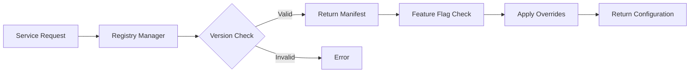

# 🎛️ **Control Plane Architecture Summary**

## **Overview**

The Control Plane serves as the **centralized governance and configuration management system** for the multi-tenant AIaaS platform. It provides runtime control, feature management, and registry services that operate independently of the core application services.

## **📁 Directory Structure**

```
control-plane/
├── configs/                    # 🔧 Configuration Management
│   ├── __init__.py
│   └── settings.py            # Platform-wide settings & config
├── feature_flags/             # 🚩 Feature Flag Management
│   ├── __init__.py
│   └── flag_manager.py        # Runtime feature toggles
└── registries/                # 📋 Asset Registry System
    ├── __init__.py
    ├── registry_manager.py     # Registry orchestration
    ├── agents/                 # AI Agent Manifests
    │   └── customer_support_agent.yaml
    └── tools/                  # Tool Manifests
        └── crm_tool.yaml
```

## **🏗️ Architecture Components**

### **1. Configuration Management (`configs/`)**

**Purpose**: Centralized platform configuration and settings management

**Key Features**:

- Environment-specific configuration loading
- Hot-reload configuration updates
- Configuration validation and schema enforcement
- Secure secrets management integration

**Implementation Status**: 🟡 **Stub** - Ready for implementation

**Usage Pattern**:

```python
from control_plane.configs.settings import ConfigManager

config = ConfigManager()
db_url = config.get("database.url", environment="production")
```

### **2. Feature Flag Management (`feature_flags/`)**

**Purpose**: Runtime feature toggling and A/B testing capabilities

**Key Features**:

- **Dynamic feature toggles** without deployments
- **Tenant-specific feature flags** for gradual rollouts
- **A/B testing framework** for feature experimentation
- **Emergency kill switches** for problematic features
- **Percentage-based rollouts** for controlled feature releases

**Implementation Status**: 🟡 **Stub** - Ready for implementation

**Usage Pattern**:

```python
from control_plane.feature_flags.flag_manager import FeatureFlagManager

flags = FeatureFlagManager()
if flags.is_enabled("new_ai_model", tenant_id="tenant123"):
    # Use new AI model
    pass
```

### **3. Registry System (`registries/`)**

**Purpose**: Versioned registry for AI agents and tools with governance

**Key Features**:

- **Versioned AI agent manifests** with checksum validation
- **Tool registry** with input/output schemas
- **Dependency management** and compatibility checking
- **Security signatures** for tamper detection
- **Metadata tracking** for ownership and changes

## **📋 Registry Manifests**

### **Agent Registry (`agents/`)**

**AI Agent Manifest Structure**:

```yaml
name: customer_support_agent
version: 1.0.0
checksum_sha256: a1b2c3d4e5f6...
created_at: "2024-01-01T00:00:00Z"
owner: platform-team
changelog: "Initial customer support agent implementation"
deprecated: false
metadata:
  description: "Handles customer support queries with FAQ and escalation"
  capabilities:
    - faq_handling
    - order_tracking
    - lead_capture
    - complaint_escalation
  max_tokens: 4000
  temperature: 0.7
  tools:
    - crm_tool
    - order_tool
    - knowledge_base_tool
  system_prompt: |
    You are a helpful customer support agent. 
    Answer questions based on the knowledge base and escalate complex issues.
signature: "abc123def456..."
```

**Key Fields**:

- **Identity**: Name, version, checksum for immutable versioning
- **Governance**: Owner, changelog, deprecation status
- **Capabilities**: Functional abilities and supported operations
- **Configuration**: LLM parameters, prompts, tool dependencies
- **Security**: Cryptographic signatures for integrity

### **Tool Registry (`tools/`)**

**Tool Manifest Structure**:

```yaml
name: crm_tool
version: 1.2.0
checksum_sha256: b2c3d4e5f6a1...
created_at: "2024-01-02T00:00:00Z"
owner: platform-team
changelog: "Added circuit breaker and retry patterns"
deprecated: false
metadata:
  description: "Customer Relationship Management operations"
  category: "data"
  inputs_schema:
    type: object
    properties:
      action:
        type: string
        enum: ["create_customer", "search_customers", "update_customer"]
      data:
        type: object
    required: ["action", "data"]
  outputs_schema:
    type: object
    properties:
      success:
        type: boolean
      result:
        type: object
      error:
        type: string
  timeout_ms: 5000
  retry_attempts: 3
  circuit_breaker_threshold: 5
signature: "def456ghi789..."
```

**Key Fields**:

- **Contract Definition**: Input/output JSON schemas
- **Resilience Configuration**: Timeouts, retries, circuit breakers
- **Categorization**: Tool classification and discovery
- **Operational Metadata**: Performance and reliability settings

## **🎯 Control Plane Benefits**

### **1. Centralized Governance**

- **Single source of truth** for all platform configurations
- **Version control** for agents and tools with audit trails
- **Security validation** through cryptographic signatures
- **Dependency management** to prevent incompatible combinations

### **2. Runtime Flexibility**

- **Feature flags** enable rapid experimentation without deployments
- **Configuration hot-reload** for zero-downtime updates
- **Tenant-specific customization** without code changes
- **Emergency controls** for rapid incident response

### **3. Operational Excellence**

- **Schema validation** prevents configuration errors
- **Change tracking** provides full audit trails
- **Rollback capabilities** for rapid error recovery
- **Performance monitoring** of feature flag impact

## **🔗 Integration Architecture**

### **Service Integration Pattern**:

```python
# Services consume control plane at startup and runtime
from control_plane import ControlPlaneClient

class OrchestorService:
    def __init__(self):
        self.control_plane = ControlPlaneClient()

    async def load_agent(self, agent_name: str):
        # Load agent from registry
        agent_manifest = await self.control_plane.get_agent(agent_name)

        # Check feature flags
        if self.control_plane.is_enabled("enhanced_reasoning"):
            agent_manifest.temperature = 0.3

        return self.create_agent(agent_manifest)
```

### **Registry Lookup Flow**:



## **🚀 Implementation Roadmap**

### **Phase 1: Foundation** 🟡 **Current**

- ✅ Directory structure established
- ✅ Registry manifests defined
- 🔄 Core managers (stub implementations)

### **Phase 2: Core Implementation** 🔵 **Next**

- 🎯 **ConfigManager**: Environment-specific settings
- 🎯 **FeatureFlagManager**: Runtime toggles with tenant support
- 🎯 **RegistryManager**: CRUD operations for agents/tools

### **Phase 3: Advanced Features** 🟢 **Future**

- 🎯 **A/B Testing Framework**: Statistical significance testing
- 🎯 **Dependency Resolution**: Automatic compatibility checking
- 🎯 **Performance Analytics**: Feature flag impact measurement
- 🎯 **Security Scanning**: Automated vulnerability assessment

## **🔧 Development Patterns**

### **Configuration Management**:

```python
# Environment-specific configuration
config = ConfigManager()
config.load_environment("production")
database_url = config.get("database.url")

# Watch for configuration changes
config.watch("ai.model_settings", callback=update_model)
```

### **Feature Flag Usage**:

```python
# Simple feature toggle
if flags.is_enabled("new_search_algorithm"):
    result = new_search(query)
else:
    result = legacy_search(query)

# Percentage rollout
if flags.is_enabled("beta_features", user_id, rollout_percentage=25):
    show_beta_ui()
```

### **Registry Operations**:

```python
# Load agent with version validation
agent = registry.get_agent("customer_support_agent", version="1.0.0")

# Validate tool compatibility
if registry.validate_tool_compatibility("crm_tool", agent.tools):
    tool = registry.get_tool("crm_tool")
```

## **📊 Monitoring & Observability**

### **Metrics Tracked**:

- **Configuration reload frequency** and success rates
- **Feature flag evaluation latency** and usage patterns
- **Registry lookup performance** and cache hit rates
- **Agent/tool version distribution** across tenants

### **Alerting**:

- **Configuration validation failures**
- **Registry corruption or signature mismatches**
- **Feature flag performance impact**
- **Deprecated asset usage warnings**

## **🔒 Security Considerations**

### **Registry Security**:

- **Cryptographic signatures** on all manifests
- **Checksum validation** for integrity verification
- **Access control** for registry modifications
- **Audit logging** for all registry operations

### **Configuration Security**:

- **Encrypted storage** for sensitive configurations
- **Access controls** based on environment and role
- **Change approval workflows** for production settings
- **Secrets rotation** automation

## **📈 Scalability Design**

### **Distributed Architecture**:

- **Registry caching** across multiple nodes
- **Feature flag evaluation** with minimal latency
- **Configuration distribution** through event streaming
- **Horizontal scaling** of control plane services

### **Performance Optimization**:

- **In-memory caching** for frequently accessed manifests
- **Lazy loading** of large configurations
- **Batch operations** for bulk registry updates
- **CDN distribution** for global configuration access

---

## **🎯 Summary**

The Control Plane provides **enterprise-grade governance and flexibility** for the multi-tenant AIaaS platform through:

1. **📋 Registry System** - Versioned, secure agent and tool management
2. **🚩 Feature Flags** - Runtime experimentation and rollout control
3. **🔧 Configuration Management** - Centralized, environment-aware settings

This architecture enables **rapid iteration**, **zero-downtime deployments**, and **fine-grained control** over platform behavior while maintaining **security**, **auditability**, and **operational excellence**.

**Current Status**: Foundation established with stub implementations ready for full development.
