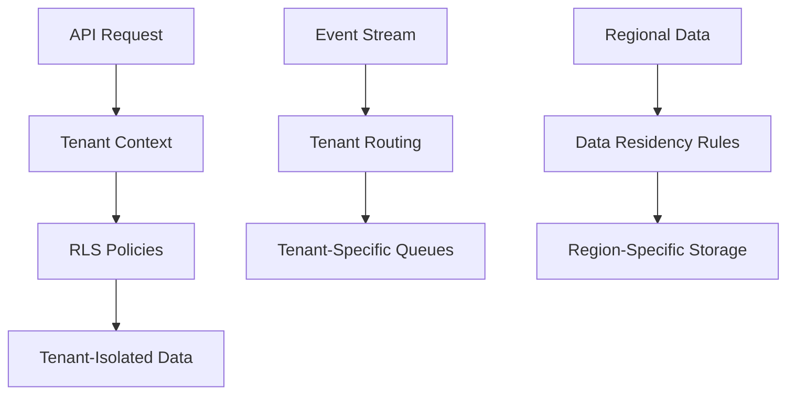
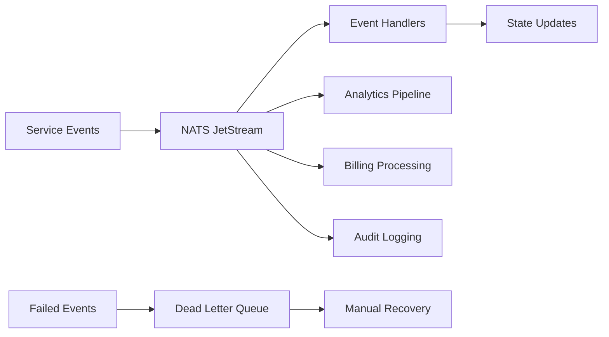

# 🗄️ **Data Plane Architecture Summary**

## **Overview**

The Data Plane serves as the **enterprise-grade data foundation** for the multi-tenant AIaaS platform. It provides comprehensive database schemas, event streaming infrastructure, and data management capabilities that enable secure, scalable, and compliant data operations across all services.

## **📁 Directory Structure**

```
data-plane/
├── storages/                  # 🗄️ Storage Infrastructure
│   ├── __init__.py
│   └── database.py           # Database client with RLS support
├── events/                   # 📡 Event Bus Infrastructure
│   ├── __init__.py
│   ├── event_handlers.py     # Event processing logic
│   └── nats_event_bus.py     # NATS streaming implementation
└── migrations/               # 🔄 Database Schema Evolution
    ├── 001_multi_tenant_schema.py    # Foundation multi-tenancy
    ├── 002_consolidated_schema.py    # Schema consolidation
    ├── 003_multi_tenant_complete.py  # Complete tenant isolation
    ├── 004_events_tables.py          # Event streaming tables
    ├── 005_multi_tenant_rls.py       # Row Level Security policies
    ├── 006_regional_schema.py        # Data residency & regionalization
    ├── 007_budget_tables.py          # Cost management & drift detection
    ├── 008_privacy_tables.py         # Privacy & DLP compliance
    ├── 009_self_serve_tables.py      # Self-service capabilities
    ├── 010_eval_replay_tables.py     # AI evaluation & replay
    └── 011_performance_gates_tables.py # Performance gating
```

## **🏗️ Architecture Components**

### **1. Storage Infrastructure (`storages/`)**

**Purpose**: Multi-tenant database layer with advanced security and compliance

**Key Features**:

- **Row Level Security (RLS)** - Automatic tenant data isolation
- **Connection pooling** - Optimized database performance
- **Read/write splitting** - Scalable query distribution
- **Encryption at rest** - Field-level encryption for sensitive data

**Implementation Status**: 🟡 **Stub** - Ready for implementation

**Usage Pattern**:

```python
from data_plane.storages.database import DatabaseClient

# Initialize with tenant context
db = DatabaseClient()
await db.set_tenant_context(tenant_id)

# RLS automatically isolates tenant data
users = await db.query("SELECT * FROM users")
```

### **2. Event Infrastructure (`events/`)**

**Purpose**: Distributed event streaming and messaging backbone

**Key Features**:

- **NATS JetStream** - Durable event streaming
- **Dead Letter Queues (DLQ)** - Failed message handling
- **Event replay** - Historical event processing
- **Circuit breakers** - Resilient event processing
- **Multi-tenant event isolation** - Secure event routing

**Implementation Status**: 🟡 **Stub** - Ready for implementation

**Usage Pattern**:

```python
from data_plane.events.nats_event_bus import NATSEventBus

# Initialize event bus
event_bus = NATSEventBus()

# Publish tenant-scoped events
await event_bus.publish("agent.run.completed", {
    "tenant_id": "tenant-123",
    "run_id": "run-456",
    "result": "success"
})

# Subscribe with automatic tenant filtering
await event_bus.subscribe("billing.*", tenant_id="tenant-123")
```

### **3. Database Migrations (`migrations/`)**

**Purpose**: Versioned schema evolution with enterprise features

## **📊 Database Schema Architecture**

### **Core Multi-Tenancy (001, 005)**

**Foundation Tables**:

```sql
-- Tenant isolation and management
tenants (tenant_id, name, plan_id, status, data_region, metadata)
users (user_id, tenant_id, email, role, status)
api_keys (key_id, tenant_id, key_hash, scopes, rate_limit)
plans (plan_id, name, price_usd, quotas, features)

-- Row Level Security policies
CREATE POLICY tenant_isolation ON users
USING (tenant_id = current_setting('app.tenant_id')::uuid)
```

**Key Features**:

- **UUID-based tenant isolation** - Cryptographically secure tenant separation
- **RLS enforcement** - Database-level security policies
- **Plan-based quotas** - Flexible billing and feature control
- **Multi-role support** - Admin, user, viewer permissions

### **Event & Workflow Management (004)**

**Event Tables**:

```sql
-- AI agent execution tracking
agent_runs (run_id, tenant_id, workflow, status, tokens_in/out, cost)
tool_calls (call_id, run_id, tool_name, input/output, status)
workflows (workflow_id, tenant_id, definition, status)
sagas (saga_id, tenant_id, steps, compensation_steps)

-- Event streaming infrastructure
events (event_id, tenant_id, type, payload, created_at)
event_subscriptions (subscription_id, tenant_id, pattern, endpoint)
dead_letter_queue (message_id, tenant_id, original_event, failure_reason)
```

**Key Features**:

- **Workflow orchestration** - LangGraph execution tracking
- **Saga pattern support** - Distributed transaction management
- **Event sourcing** - Complete audit trail of all operations
- **Partitioned storage** - Time-based partitioning for performance

### **Data Residency & Regionalization (006)**

**Regional Tables**:

```sql
-- Multi-region provider management
regional_providers (id, region, provider_type, provider_name, endpoint_url)
analytics_events_regional (partitioned by data_region)

-- Tenant regional configuration
tenants.data_region        -- Primary data region
tenants.allowed_regions    -- Permitted regions array
tenants.regional_config    -- Region-specific settings
```

**Key Features**:

- **Data sovereignty** - Region-specific data storage
- **Provider routing** - Regional AI service providers
- **Cross-region replication** - Controlled data sharing
- **Compliance automation** - GDPR, CCPA, SOC2 compliance

### **Financial Management (007)**

**Budget & Cost Tables**:

```sql
-- Budget management and alerts
tenant_budgets (tenant_id, period, amount, warning/critical_thresholds)
billing_events (tenant_id, request_id, service_type, cost_usd)
request_metrics (tenant_id, request_id, tokens, cost, tier)

-- Drift detection and optimization
cost_predictions (tenant_id, period, predicted_cost, confidence)
optimization_suggestions (tenant_id, suggestion_type, potential_savings)
```

**Key Features**:

- **Real-time cost tracking** - Per-request billing accuracy
- **Budget alerts** - Proactive cost management
- **Drift detection** - Anomaly identification in usage patterns
- **Cost optimization** - AI-driven efficiency recommendations

### **Privacy & DLP (008)**

**Privacy Tables**:

```sql
-- Data sensitivity and protection
sensitivity_tags (document_id, tenant_id, sensitivity_level, pii_detected)
encryption_keys (key_id, tenant_id, algorithm, key_version)
encrypted_fields (tenant_id, field_name, encrypted_data, key_id)

-- Privacy compliance and monitoring
privacy_policies (policy_id, tenant_id, rules, sensitivity_level)
pii_detections (detection_id, tenant_id, pii_type, confidence)
privacy_violations (violation_id, tenant_id, violation_type, severity)
data_access_logs (access_id, tenant_id, user_id, resource_type, pii_accessed)
```

**Key Features**:

- **Automated PII detection** - ML-powered sensitive data identification
- **Field-level encryption** - Granular data protection
- **Key rotation** - Automated encryption key lifecycle
- **Compliance monitoring** - Real-time privacy violation detection
- **Access auditing** - Complete data access trails

### **Self-Service Capabilities (009)**

**Self-Service Tables**:

```sql
-- Plan management and onboarding
plan_configurations (plan_name, features, limits, pricing)
tenant_onboarding (request_id, email, plan, status, verification_token)
plan_changes (change_id, tenant_id, from_plan, to_plan, status)

-- Webhook and integration management
webhook_endpoints (endpoint_id, tenant_id, url, events, secret)
webhook_deliveries (delivery_id, endpoint_id, event_data, status)
integration_configs (config_id, tenant_id, integration_type, settings)
```

**Key Features**:

- **Automated onboarding** - Self-service tenant registration
- **Plan upgrades/downgrades** - Seamless plan transitions
- **Webhook management** - Real-time event notifications
- **Integration marketplace** - Third-party service connections

### **AI Evaluation & Performance (010, 011)**

**AI Quality Tables**:

```sql
-- Model evaluation and testing
eval_datasets (dataset_id, tenant_id, name, test_cases)
eval_runs (run_id, dataset_id, model_config, metrics)
eval_results (result_id, run_id, test_case_id, actual, expected, score)

-- Performance gating and quality control
performance_gates (gate_id, tenant_id, metric_type, threshold)
gate_evaluations (evaluation_id, gate_id, metric_value, passed)
model_deployments (deployment_id, tenant_id, model_version, gate_results)
```

**Key Features**:

- **A/B testing framework** - Systematic model comparison
- **Quality gating** - Automated performance thresholds
- **Regression testing** - Continuous model validation
- **Performance monitoring** - Real-time quality metrics

## **🔗 Data Flow Architecture**

### **Multi-Tenant Data Isolation**:



### **Event-Driven Architecture**:



## **🛡️ Security & Compliance**

### **Multi-Layer Security**:

1. **Network Level**: TLS encryption, VPC isolation
2. **Database Level**: RLS policies, encrypted connections
3. **Application Level**: JWT authentication, RBAC
4. **Data Level**: Field-level encryption, key rotation
5. **Audit Level**: Complete access logging, tamper-evident logs

### **Compliance Features**:

- **GDPR**: Right to erasure, data portability, consent management
- **CCPA**: Data inventory, opt-out mechanisms, disclosure tracking
- **SOC2**: Security controls, availability monitoring, confidentiality
- **HIPAA**: PHI protection, access controls, audit trails

## **📈 Performance & Scalability**

### **Database Optimization**:

- **Partitioning**: Time-based and tenant-based partitioning
- **Indexing**: Optimized for multi-tenant queries
- **Connection Pooling**: Efficient resource utilization
- **Read Replicas**: Load distribution across regions

### **Event Streaming**:

- **Horizontal Scaling**: Auto-scaling event consumers
- **Backpressure Handling**: Graceful overload management
- **Stream Persistence**: Durable event storage
- **Replay Capabilities**: Historical event processing

## **🔧 Development & Operations**

### **Migration Management**:

```python
# Progressive schema evolution
async def upgrade_tenant_schema(tenant_id: str, target_version: str):
    # 1. Validate current schema version
    current = await get_schema_version(tenant_id)

    # 2. Plan migration path
    migrations = plan_migration_path(current, target_version)

    # 3. Execute migrations with rollback support
    for migration in migrations:
        try:
            await migration.apply(tenant_id)
        except Exception as e:
            await migration.rollback(tenant_id)
            raise
```

### **Data Lifecycle Management**:

- **Automated archiving** - Age-based data movement
- **Retention policies** - Compliance-driven data purging
- **Backup automation** - Point-in-time recovery
- **Disaster recovery** - Cross-region replication

## **📊 Monitoring & Observability**

### **Data Metrics**:

- **Query performance** - Latency, throughput, error rates
- **Storage utilization** - Growth rates, capacity planning
- **Event processing** - Stream lag, processing rates
- **Compliance status** - Policy violations, audit completeness

### **Alerting**:

- **Performance degradation** - Query timeout increases
- **Capacity warnings** - Storage or compute limits
- **Security incidents** - Unauthorized access attempts
- **Compliance violations** - Policy breaches

## **🎯 Integration Points**

### **Service Dependencies**:

```python
# Services consume data plane through standardized clients
from data_plane import DataPlaneClient

class ServiceBase:
    def __init__(self):
        self.data_plane = DataPlaneClient()

    async def setup_tenant_context(self, tenant_id: str):
        await self.data_plane.set_tenant_context(tenant_id)

    async def emit_event(self, event_type: str, payload: dict):
        await self.data_plane.events.publish(event_type, payload)
```

### **Cross-Platform Features**:

- **Shared libraries** - Common data access patterns
- **Event schemas** - Standardized event formats
- **Migration tools** - Automated schema evolution
- **Backup/restore** - Platform-wide data protection

## **🚀 Implementation Status**

### **Current State**: 🟡 **Foundation Complete**

- ✅ **Schema Design** - Complete migration set defined
- ✅ **RLS Policies** - Multi-tenant security implemented
- ✅ **Event Tables** - Streaming infrastructure ready
- 🟡 **Client Libraries** - Stub implementations ready for development

### **Next Phase**: 🔵 **Core Implementation**

- 🎯 **Database Client** - RLS-aware query interface
- 🎯 **Event Bus** - NATS JetStream integration
- 🎯 **Migration Engine** - Automated schema evolution
- 🎯 **Monitoring Dashboard** - Data plane observability

### **Future Enhancements**: 🟢 **Advanced Features**

- 🎯 **Multi-Region Sync** - Cross-region data consistency
- 🎯 **Advanced Analytics** - Real-time data processing
- 🎯 **AI-Powered Optimization** - Intelligent resource management
- 🎯 **Zero-Downtime Migrations** - Live schema evolution

---

## **🎯 Summary**

The Data Plane provides **enterprise-grade data infrastructure** that enables:

1. **🏢 Multi-Tenancy** - Secure, isolated data access per tenant
2. **🌍 Global Scale** - Regional data residency and compliance
3. **💰 Cost Management** - Real-time billing and budget controls
4. **🔒 Privacy Protection** - Automated PII detection and encryption
5. **📡 Event Architecture** - Reliable, scalable event streaming
6. **🔄 Schema Evolution** - Zero-downtime database migrations
7. **📊 Observability** - Complete data access and performance monitoring

This architecture supports **high-scale SaaS operations** with **enterprise security**, **compliance automation**, and **operational excellence** while maintaining **developer productivity** and **platform reliability**.

**Foundation Status**: Schema and event infrastructure ready for full implementation.
