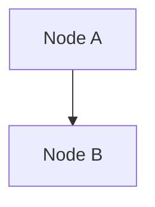
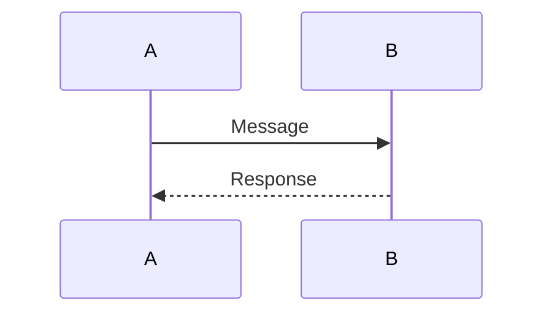

# 📝 Markdown with Mermaid Diagrams Guide

## 🎯 **Quick Start: Viewing Diagrams from Markdown**

### **Method 1: VS Code (Best Experience)**

```bash
# Install Mermaid extension
code --install-extension bierner.markdown-mermaid

# Open the Markdown file
code docs/flows/SERVICE_FLOWS.md

# Press Ctrl+Shift+V (Cmd+Shift+V on Mac) for preview
# Diagrams render automatically with syntax highlighting
```

### **Method 2: GitHub (No Installation)**

```bash
# Push to GitHub repository
git add docs/flows/SERVICE_FLOWS.md
git commit -m "Add service flow diagrams"
git push

# View on GitHub - diagrams render automatically
# Works on mobile devices too
```

### **Method 3: Mermaid Live Editor (Online)**

````bash
# Copy diagram code from Markdown
cat docs/flows/SERVICE_FLOWS.md | grep -A 50 "```mermaid" | head -60

# Paste into https://mermaid.live/
# View with custom themes and export options
````

### **Method 4: Export as Images**

```bash
# Render all diagrams from Markdown as PNG files
mmdc -i docs/flows/SERVICE_FLOWS.md -o docs/flows/SERVICE_FLOWS.png -t dark -b white -s 3

# This creates:
# - SERVICE_FLOWS-1.png (System Architecture)
# - SERVICE_FLOWS-2.png (User Journey)
# - SERVICE_FLOWS-3.png (Data Flow)
# - SERVICE_FLOWS-4.png (Web Chat)
# - SERVICE_FLOWS-5.png (Chat Adapters)
# - SERVICE_FLOWS-6.png (Document Ingestion)
# - SERVICE_FLOWS-7.png (Retrieval)
# - SERVICE_FLOWS-8.png (Billing & Analytics)
```

## 📊 **Generated Files**

| File                  | Size  | Description                  |
| --------------------- | ----- | ---------------------------- |
| `SERVICE_FLOWS-1.png` | 1.3MB | Complete System Architecture |
| `SERVICE_FLOWS-2.png` | 590KB | Complete User Journey        |
| `SERVICE_FLOWS-3.png` | 517KB | Comprehensive Data Flow      |
| `SERVICE_FLOWS-4.png` | 332KB | Web Chat Flow                |
| `SERVICE_FLOWS-5.png` | 220KB | Chat Adapters Flow           |
| `SERVICE_FLOWS-6.png` | 240KB | Document Ingestion Flow      |
| `SERVICE_FLOWS-7.png` | 227KB | Retrieval Flow               |
| `SERVICE_FLOWS-8.png` | 190KB | Billing & Analytics Flow     |

## 🎨 **Markdown Syntax for Mermaid**

### Basic Structure

````markdown
# Title

## Section


````

## Another Section



````

### Advanced Features
```markdown
```mermaid
%% Comments in Mermaid
graph TB
    subgraph "Group Name"
        A[Node A]
        B[Node B]
    end

    A --> B

    %% Styling
    classDef className fill:#color,stroke:#color,stroke-width:2px
    class A,B className
````

````

## 🚀 **Quick Commands**

### View in VS Code
```bash
code docs/flows/SERVICE_FLOWS.md
# Press Ctrl+Shift+V for preview
````

### Export All Diagrams

```bash
mmdc -i docs/flows/SERVICE_FLOWS.md -o output.png -s 3 -w 4000 -H 3000
```

### View on GitHub

```bash
# Push to GitHub and view online
git add docs/flows/SERVICE_FLOWS.md
git commit -m "Add diagrams"
git push
```

### Copy to Mermaid Live

````bash
# Copy specific diagram
sed -n '/```mermaid/,/```/p' docs/flows/SERVICE_FLOWS.md | head -50
````

## 💡 **Pro Tips**

1. **VS Code Preview**: Best for development, live editing
2. **GitHub Rendering**: Best for sharing, mobile-friendly
3. **Mermaid Live**: Best for experimentation, custom themes
4. **PNG Export**: Best for presentations, documentation

## 🔧 **Troubleshooting**

### If diagrams don't render in VS Code:

1. Install `bierner.markdown-mermaid` extension
2. Restart VS Code
3. Check file encoding (UTF-8)

### If GitHub doesn't render:

1. Check Mermaid syntax
2. Ensure proper code block formatting
3. Try different themes

### If export fails:

1. Check Mermaid CLI installation
2. Verify file paths
3. Try different themes

## 📱 **Mobile Viewing**

- **GitHub**: Automatic rendering on mobile
- **VS Code Mobile**: Limited support
- **Mermaid Live**: Mobile-friendly web interface
- **PNG Files**: Open in mobile image viewers

---

## 🎯 **Summary**

The `SERVICE_FLOWS.md` file contains all your diagrams in one place:

- ✅ **8 High-resolution diagrams** (1.3MB total)
- ✅ **VS Code integration** (live preview)
- ✅ **GitHub compatibility** (automatic rendering)
- ✅ **Mobile-friendly** (responsive design)
- ✅ **Export ready** (PNG, SVG, PDF)

**Best viewing experience**: Open `docs/flows/SERVICE_FLOWS.md` in VS Code with Mermaid extension!
