# 🎨 Multi-AI-Agent Platform - Service Flow Diagrams

This document contains all service flow diagrams rendered directly from Markdown using Mermaid code blocks.

## 🏗️ Complete System Architecture

```mermaid
graph TB
    %% Frontend Layer
    subgraph "🎨 Frontend Layer"
        ChatbotUI["🤖 AI Chatbot UI<br/>:3001<br/>React • Vite<br/>Real-time Chat"]
        WebFrontend["🌐 Web Frontend<br/>:3000<br/>React • Vite<br/>User Dashboard"]
        AdminPortal["⚙️ Admin Portal<br/>:8099<br/>FastAPI • HTML<br/>System Management"]
    end

    %% API Gateway
    subgraph "🚪 API Gateway"
        APIGateway["🔗 API Gateway<br/>:8000<br/>FastAPI • Auth<br/>Request Routing"]
    end

    %% Data Plane Services
    subgraph "📊 Data Plane Services"
        ModelGateway["🧠 Model Gateway<br/>:8080<br/>AI Routing • Load Balancing<br/>Provider Management"]
        RouterService["🎯 Router Service<br/>:8081<br/>Query Classification<br/>Tier Selection"]
        RetrievalService["🔍 Retrieval Service<br/>:8082<br/>Vector Search • RAG<br/>Context Building"]
        IngestionService["📥 Ingestion Service<br/>:8083<br/>Document Processing<br/>Vector Indexing"]
        MemoryService["🧠 Memory Service<br/>:8084<br/>Conversation History<br/>Context Management"]
        ToolsService["🛠️ Tools Service<br/>:8085<br/>Function Calling<br/>Tool Execution"]
        RealtimeGateway["⚡ Realtime Gateway<br/>:8086<br/>WebSocket • SSE<br/>Live Updates"]
        SemanticCache["💾 Semantic Cache<br/>:8087<br/>Query Caching<br/>Response Optimization"]
        EventRelay["📡 Event Relay<br/>:8088<br/>NATS → HTTP<br/>Webhook Delivery"]
        MigrationRunner["🔄 Migration Runner<br/>:8089<br/>Schema Evolution<br/>Data Migration"]
    end

    %% Control Plane Services
    subgraph "🎛️ Control Plane Services"
        ConfigService["⚙️ Config Service<br/>:8090<br/>Configuration Management<br/>Environment Settings"]
        PolicyAdapter["📋 Policy Adapter<br/>:8091<br/>Access Control<br/>Compliance Rules"]
        FeatureFlags["🚩 Feature Flags<br/>:8092<br/>A/B Testing<br/>Feature Toggles"]
        RegistryService["📋 Registry Service<br/>:8093<br/>Service Discovery<br/>Health Monitoring"]
        UsageMetering["📊 Usage Metering<br/>:8094<br/>Cost Tracking<br/>Billing Events"]
        AuditLog["📝 Audit Log<br/>:8095<br/>Activity Logging<br/>Compliance"]
        NotificationService["📢 Notification Service<br/>:8096<br/>Alerts • Emails<br/>User Notifications"]
    end

    %% Chat Adapters
    subgraph "💬 Chat Adapters"
        ChatAdapters["📱 Chat Adapters<br/>:8097<br/>Facebook • Zalo • TikTok<br/>Multi-platform Integration"]
    end

    %% External Services
    subgraph "🌍 External Services"
        OpenAI["🤖 OpenAI<br/>GPT-4 • GPT-3.5<br/>Text Generation"]
        Firecrawl["🕷️ Firecrawl<br/>Web Scraping<br/>Real-time Data"]
        Anthropic["🧠 Anthropic<br/>Claude 3<br/>AI Assistant"]
    end

    %% Infrastructure
    subgraph "🏗️ Infrastructure"
        PostgreSQL["🗄️ PostgreSQL<br/>:5432<br/>Primary Database<br/>RLS • Multi-tenant"]
        Redis["⚡ Redis<br/>:6379<br/>Cache • Sessions<br/>Feature Flags"]
        NATS["📡 NATS JetStream<br/>:4222<br/>Event Streaming<br/>Message Queue"]
        VectorDB["🔍 Vector Database<br/>:6333<br/>Embeddings<br/>Semantic Search"]
    end

    %% Frontend Connections
    ChatbotUI --> APIGateway
    WebFrontend --> APIGateway
    AdminPortal --> APIGateway

    %% API Gateway Connections
    APIGateway --> ModelGateway
    APIGateway --> RouterService
    APIGateway --> RetrievalService
    APIGateway --> IngestionService
    APIGateway --> MemoryService
    APIGateway --> ToolsService
    APIGateway --> ChatAdapters

    %% Data Plane Interconnections
    RouterService --> RetrievalService
    RouterService --> ModelGateway
    RetrievalService --> VectorDB
    RetrievalService --> MemoryService
    IngestionService --> VectorDB
    IngestionService --> PostgreSQL
    MemoryService --> PostgreSQL
    ToolsService --> RealtimeGateway
    RealtimeGateway --> APIGateway
    SemanticCache --> Redis
    EventRelay --> NATS
    MigrationRunner --> PostgreSQL

    %% Control Plane Connections
    ConfigService --> APIGateway
    PolicyAdapter --> APIGateway
    FeatureFlags --> APIGateway
    RegistryService --> APIGateway
    UsageMetering --> NATS
    AuditLog --> PostgreSQL
    NotificationService --> NATS

    %% External API Connections
    ModelGateway --> OpenAI
    ModelGateway --> Anthropic
    ToolsService --> Firecrawl

    %% Infrastructure Connections
    APIGateway --> PostgreSQL
    APIGateway --> Redis
    APIGateway --> NATS
    ModelGateway --> Redis
    RouterService --> Redis
    RetrievalService --> Redis
    MemoryService --> Redis

    %% Styling
    classDef frontend fill:#e1f5fe,stroke:#01579b,stroke-width:2px
    classDef datacenter fill:#f3e5f5,stroke:#4a148c,stroke-width:2px
    classDef control fill:#e8f5e8,stroke:#1b5e20,stroke-width:2px
    classDef external fill:#fff3e0,stroke:#e65100,stroke-width:2px
    classDef infrastructure fill:#fce4ec,stroke:#880e4f,stroke-width:2px

    class ChatbotUI,WebFrontend,AdminPortal frontend
    class ModelGateway,RouterService,RetrievalService,IngestionService,MemoryService,ToolsService,RealtimeGateway,SemanticCache,EventRelay,MigrationRunner datacenter
    class ConfigService,PolicyAdapter,FeatureFlags,RegistryService,UsageMetering,AuditLog,NotificationService control
    class OpenAI,Firecrawl,Anthropic external
    class PostgreSQL,Redis,NATS,VectorDB infrastructure
```



## 🔄 Complete User Journey

```mermaid
sequenceDiagram
    participant User as 👤 User
    participant Chatbot as 🤖 Chatbot UI
    participant Gateway as 🚪 API Gateway
    participant Router as 🎯 Router Service
    participant Retrieval as 🔍 Retrieval Service
    participant Memory as 🧠 Memory Service
    participant Model as 🧠 Model Gateway
    participant OpenAI as 🤖 OpenAI
    participant Firecrawl as 🕷️ Firecrawl
    participant Cache as 💾 Semantic Cache
    participant Usage as 📊 Usage Metering

    Note over User,Usage: 🚀 Complete User Journey Flow

    User->>Chatbot: 💬 "What's the weather in HCM today?"
    Chatbot->>Gateway: 📡 POST /chat/message
    Note over Gateway: 🔐 Authentication & Rate Limiting

    Gateway->>Router: 🎯 Classify query type
    Router-->>Gateway: 📋 Query Type: Web Search

    Gateway->>Cache: 💾 Check semantic cache
    Cache-->>Gateway: ❌ Cache miss

    Gateway->>Memory: 🧠 Get conversation context
    Memory-->>Gateway: 📚 Context: Previous messages

    Gateway->>Retrieval: 🔍 Search for weather info
    Retrieval-->>Gateway: 📊 No relevant documents

    Gateway->>Firecrawl: 🕷️ Search web for weather
    Firecrawl-->>Gateway: 🌤️ Weather data: 28°C, Sunny

    Gateway->>Model: 🧠 Generate response with context
    Model->>OpenAI: 🤖 GPT-4 API call
    OpenAI-->>Model: 💬 "It's 28°C and sunny in HCM today"
    Model-->>Gateway: 📝 Formatted response

    Gateway->>Memory: 💾 Save conversation
    Gateway->>Cache: 💾 Cache response
    Gateway->>Usage: 📊 Track usage & costs

    Gateway-->>Chatbot: 📡 Streaming response
    Chatbot-->>User: 💬 "It's 28°C and sunny in HCM today! ☀️"

    Note over User,Usage: ✅ Complete flow with caching, memory, and usage tracking
```



## 📊 Comprehensive Data Flow

```mermaid
graph TB
    %% User Input Types
    subgraph "👤 User Input Types"
        ChatQuery["💬 Chat Query<br/>What's the weather?<br/>Explain AI<br/>Latest news"]
        DocumentUpload["📄 Document Upload<br/>PDF • DOCX • TXT<br/>Company Handbook<br/>Technical Docs"]
        SocialMessage["📱 Social Message<br/>Facebook Messenger<br/>Zalo Chat • TikTok<br/>Multi-platform"]
        AdminAction["⚙️ Admin Action<br/>User Management<br/>System Configuration<br/>Analytics Viewing"]
    end

    %% Processing Paths
    subgraph "🔄 Processing Paths"
        ChatPath["💬 Chat Processing<br/>Router → Retrieval → AI<br/>Real-time Response"]
        DocPath["📄 Document Processing<br/>Ingestion → Vector DB<br/>Searchable Knowledge"]
        SocialPath["📱 Social Processing<br/>Adapters → Core Services<br/>Multi-platform Sync"]
        AdminPath["⚙️ Admin Processing<br/>Portal → Control Plane<br/>System Management"]
    end

    %% Data Storage
    subgraph "💾 Data Storage"
        PostgreSQL["🗄️ PostgreSQL<br/>User Data • Conversations<br/>Multi-tenant RLS"]
        VectorDB["🔍 Vector Database<br/>Document Embeddings<br/>Semantic Search"]
        Redis["⚡ Redis<br/>Cache • Sessions<br/>Feature Flags"]
        NATS["📡 NATS JetStream<br/>Event Streaming<br/>Message Queue"]
    end

    %% Output Types
    subgraph "📤 Output Types"
        ChatResponse["💬 Chat Response<br/>AI-generated answers<br/>Real-time streaming"]
        SearchResults["🔍 Search Results<br/>Relevant documents<br/>Ranked by relevance"]
        SocialReply["📱 Social Reply<br/>Platform-specific<br/>Formatted messages"]
        AdminDashboard["📊 Admin Dashboard<br/>Analytics • Reports<br/>System status"]
    end

    %% Connections
    ChatQuery --> ChatPath
    DocumentUpload --> DocPath
    SocialMessage --> SocialPath
    AdminAction --> AdminPath

    ChatPath --> PostgreSQL
    ChatPath --> VectorDB
    ChatPath --> Redis
    ChatPath --> NATS

    DocPath --> VectorDB
    DocPath --> PostgreSQL

    SocialPath --> PostgreSQL
    SocialPath --> Redis
    SocialPath --> NATS

    AdminPath --> PostgreSQL
    AdminPath --> Redis

    ChatPath --> ChatResponse
    DocPath --> SearchResults
    SocialPath --> SocialReply
    AdminPath --> AdminDashboard

    %% Styling
    classDef input fill:#e3f2fd,stroke:#1976d2,stroke-width:2px
    classDef process fill:#f3e5f5,stroke:#7b1fa2,stroke-width:2px
    classDef storage fill:#e8f5e8,stroke:#388e3c,stroke-width:2px
    classDef output fill:#fff3e0,stroke:#f57c00,stroke-width:2px

    class ChatQuery,DocumentUpload,SocialMessage,AdminAction input
    class ChatPath,DocPath,SocialPath,AdminPath process
    class PostgreSQL,VectorDB,Redis,NATS storage
    class ChatResponse,SearchResults,SocialReply,AdminDashboard output
```



## 💬 Web Chat Flow

```mermaid
sequenceDiagram
    participant User as 👤 User
    participant Chatbot as 🤖 Chatbot UI
    participant Gateway as 🚪 API Gateway
    participant Router as 🎯 Router Service
    participant Retrieval as 🔍 Retrieval Service
    participant Model as 🧠 Model Gateway
    participant OpenAI as 🤖 OpenAI
    participant Firecrawl as 🕷️ Firecrawl

    User->>Chatbot: 💬 "What's the latest AI news?"
    Chatbot->>Gateway: 📡 POST /chat/message

    Gateway->>Router: 🎯 Classify query
    Router-->>Gateway: 📋 Type: Web Search

    Gateway->>Retrieval: 🔍 Search knowledge base
    Retrieval-->>Gateway: 📊 No recent results

    Gateway->>Firecrawl: 🕷️ Search web
    Firecrawl-->>Gateway: 📰 Latest AI news

    Gateway->>Model: 🧠 Generate response
    Model->>OpenAI: 🤖 API call with context
    OpenAI-->>Model: 💬 AI-generated response
    Model-->>Gateway: 📝 Formatted answer

    Gateway-->>Chatbot: 📡 Streaming response
    Chatbot-->>User: 💬 "Here's the latest AI news..."
```



## 📱 Chat Adapters Flow

```mermaid
sequenceDiagram
    participant Facebook as 📘 Facebook
    participant Zalo as 💙 Zalo
    participant TikTok as 🎵 TikTok
    participant Adapters as 📱 Chat Adapters
    participant Gateway as 🚪 API Gateway
    participant Core as 🧠 Core Services

    Facebook->>Adapters: 📨 Message from user
    Zalo->>Adapters: 📨 Message from user
    TikTok->>Adapters: 📨 Message from user

    Adapters->>Gateway: 🔄 Normalize messages
    Gateway->>Core: 🎯 Process with AI

    Core-->>Gateway: 💬 AI response
    Gateway-->>Adapters: 📝 Formatted reply

    Adapters->>Facebook: 📤 Send to Facebook
    Adapters->>Zalo: 📤 Send to Zalo
    Adapters->>TikTok: 📤 Send to TikTok
```



## 📥 Document Ingestion Flow

```mermaid
sequenceDiagram
    participant User as 👤 User
    participant Web as 🌐 Web Frontend
    participant Gateway as 🚪 API Gateway
    participant Ingestion as 📥 Ingestion Service
    participant VectorDB as 🔍 Vector DB
    participant PostgreSQL as 🗄️ PostgreSQL

    User->>Web: 📄 Upload document
    Web->>Gateway: 📡 POST /ingestion/upload

    Gateway->>Ingestion: 🔄 Process document
    Ingestion->>Ingestion: 📝 Extract text
    Ingestion->>Ingestion: 🔍 Generate embeddings

    Ingestion->>VectorDB: 💾 Store embeddings
    Ingestion->>PostgreSQL: 💾 Store metadata

    Ingestion-->>Gateway: ✅ Processing complete
    Gateway-->>Web: 📊 Upload successful
    Web-->>User: ✅ Document indexed
```



## 🔍 Retrieval Flow

```mermaid
sequenceDiagram
    participant User as 👤 User
    participant Gateway as 🚪 API Gateway
    participant Router as 🎯 Router Service
    participant Retrieval as 🔍 Retrieval Service
    participant VectorDB as 🔍 Vector DB
    participant Model as 🧠 Model Gateway

    User->>Gateway: ❓ Query question
    Gateway->>Router: 🎯 Classify query

    Router-->>Gateway: 📋 Query type
    Gateway->>Retrieval: 🔍 Search knowledge

    Retrieval->>VectorDB: 🔎 Semantic search
    VectorDB-->>Retrieval: 📊 Relevant documents

    Retrieval-->>Gateway: 📚 Context + documents
    Gateway->>Model: 🧠 Generate with context

    Model-->>Gateway: 💬 AI response
    Gateway-->>User: 📡 Final answer
```



## 📊 Billing & Analytics Flow

```mermaid
sequenceDiagram
    participant Service as 🧠 Any Service
    participant Usage as 📊 Usage Metering
    participant Billing as 💳 Billing Service
    participant Analytics as 📈 Analytics
    participant Admin as ⚙️ Admin Portal

    Service->>Usage: 📊 Track API call
    Usage->>Usage: 💰 Calculate cost

    Usage->>Billing: 💳 Update billing
    Usage->>Analytics: 📈 Update metrics

    Billing->>Admin: 📊 Billing dashboard
    Analytics->>Admin: 📈 Usage analytics

    Admin->>Admin: 📋 Generate reports
```



---

## 🎯 **How to View These Diagrams**

### **Option 1: VS Code (Recommended)**

1. Install Mermaid extension: `bierner.markdown-mermaid`
2. Open this `.md` file in VS Code
3. Press `Ctrl+Shift+V` (or `Cmd+Shift+V` on Mac) for preview
4. Diagrams render automatically in the preview

### **Option 2: GitHub**

1. Push this file to GitHub
2. GitHub automatically renders Mermaid diagrams
3. View on any device, mobile-friendly

### **Option 3: Mermaid Live Editor**

1. Go to [Mermaid Live Editor](https://mermaid.live/)
2. Copy any diagram code block
3. Paste and view with custom themes

### **Option 4: Export as Images**

```bash
# Export specific diagrams as high-res PNG
mmdc -i SERVICE_FLOWS.md -o service-flows.png -t dark -b white -s 3
```

## 📋 **Diagram Summary**

| Diagram                 | Description         | Key Features                     |
| ----------------------- | ------------------- | -------------------------------- |
| **System Architecture** | Complete system map | All services, connections, ports |
| **User Journey**        | End-to-end flow     | Step-by-step interaction         |
| **Data Flow**           | Input processing    | All data types and paths         |
| **Web Chat**            | Chat interaction    | Real-time AI responses           |
| **Chat Adapters**       | Multi-platform      | Facebook, Zalo, TikTok           |
| **Document Ingestion**  | File processing     | PDF, DOCX, TXT handling          |
| **Retrieval**           | Knowledge search    | Vector search, RAG               |
| **Billing & Analytics** | Usage tracking      | Cost monitoring, reports         |

---

_This document provides a comprehensive view of all service flows in the Multi-AI-Agent Platform. Use VS Code with Mermaid extension for the best viewing experience._
